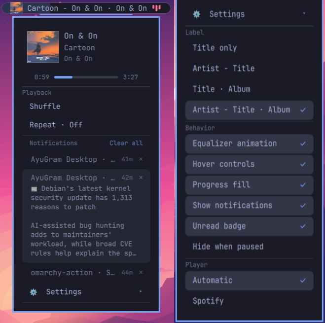

# Dynamic Island (`sharifmdathar.dynamic-island`)

A third-party Omarchy bar widget: a compact live pill for now-playing media,
notification previews and an unread inbox. It collapses to zero width when
idle, so it never takes up bar space for nothing.

- `manifest.json` declares the plugin (`id: sharifmdathar.dynamic-island`,
  `kind: bar-widget`, default section `center`).
- `BarWidget.qml` owns the state: MPRIS media tracking, the notification
  archive, persisted options and the pill. The pieces sit beside it —
  `IslandMenu.qml` (the card), `TransportControls.qml` (hover buttons),
  `EqualizerBars.qml` (playing animation) — with the pure helpers,
  including all notification parsing, in `IslandModel.js`.

Enable it with `omarchy plugin enable sharifmdathar.dynamic-island`; it lands in
the bar's center section next to the clock.

## Preview 

### (Click to watch full demo on YouTube)

[](https://youtu.be/VII630kGqz8)

<!--  -->

## Plugin page

https://plugins.omarchy.org/plugin.html?id=sharifmdathar.dynamic-island

## Installation

```sh
omarchy plugin add https://github.com/sharifmdathar/dynamic-island-omarchy.git --enable
```

This clones the repository as a shell plugin, validates its manifest, and
places the widget in the bar's center section. No other setup needed.

## Removal

```sh
omarchy plugin remove sharifmdathar.dynamic-island
```

Removal deletes the plugin directory. Your other bar layout entries are
untouched; the island's own layout entry (label mode, toggles, pinned
player, inbox read marker) is dropped along with it. Your notification
archive itself belongs to the daemon and stays where it is.

## Gestures

- **Left click** the pill: play/pause toggle. With nothing playing it opens
  the notification inbox instead.
- **Middle click** the pill: raise the player window (ignored when the
  player can't raise).
- **Hover** the pill: swaps the label/EQ for prev / play-pause / next
  transport controls (disable via menu). The three buttons cover the whole
  pill height with no gaps between them, so a click in that band always
  hits a button rather than falling through to play/pause.
- **Scroll** on the pill: player volume ±5% per notch (ignored when the
  player reports no volume support). The pill briefly shows `♪ 45%` so the
  gesture has feedback.
- **Right click** the pill: opens the options menu. Clicking elsewhere
  dismisses it.

## Options menu

Right-click opens a now-playing header — large artwork, title, artist and
album on their own lines — with an elapsed / seek-bar / total row below
it when the player supports seeking (click or drag to seek). Clicking
the header raises the player app; the **⚙ Settings** button below it
expands the settings sections. Everything
persists to the widget's `shell.json` layout entry via
`updateEntryInline`, so choices survive restarts and sync across monitors.

**Label** — what the pill shows for the current track:

| Mode | Renders as |
|---|---|
| Title only | `Title` |
| Artist - Title | `Artist - Title` |
| Title · Album | `Title · Album` |
| Artist - Title · Album | `Artist - Title · Album` |

Album modes fall back gracefully when the player reports no album.

**Playback** — shuffle and repeat (`Off → One → All`) when the player
reports support for them. Tapping either keeps the card open so the row
flips in place. Both rows disappear for players that support neither.

**Behavior** — `Hide when paused` collapses the pill while paused
(resume playback, or `omarchy-shell island setOption hideWhenPaused false`,
to get the menu back), plus toggles for the equalizer animation, hover
transport controls, progress fill across the pill, notification previews,
and the unread badge (see below).

**Player** — `Automatic` follows the most recently playing source; picking
a listed source pins the island to it until that source goes quiet.

Long row labels (e.g. the album variants at fixed menu width)
marquee-scroll on hover instead of clipping.

## Notification inbox

The island also mirrors your notification archive, so the pill works as a
lightweight inbox:

- A live toast replaces the label with `App · headline` while it is on
  screen.
- Toasts that have left the screen stay in the archive (the daemon keeps
  the ten newest). The card lists them newest first with their age.
- Unread entries keep the pill open when nothing is playing — it reads
  `3 unread` — and drop a dot on the pill's corner when media owns the
  label. Turn this off with the `Unread badge` toggle.
- **Hover a row** to unfold it: the body wraps out under the headline so
  the whole message is readable in place, and the row folds back when the
  pointer leaves. The list slides to make room — the row's own top edge
  never moves, so the cursor stays inside it. Entries with nothing hidden
  (no body, headline not clipped) stay one line.
- **Click a row** to run the notification's own action (the `--exec` the
  sender attached) and clear it. **Click ✕** to clear without acting.
  **Clear all** empties the archive.
- Opening the card counts the archive as read, which clears the badge. The
  mark persists, so it stays cleared across restarts and monitors.

Archive entries that predate the badge are baselined as read once, so
installing this never opens with a shout about old mail.

The archive is read from `~/.local/state/omarchy/notifications/`, the
daemon's public on-disk state — a third-party widget is not given the
notification service object. Removals take the entry's JSON and the image
copies that share its stem, the same cleanup the daemon itself does.

## Theming

All colors are theme-aware: pill and text follow `Color.bar`, selection
chrome follows the shared `Style` hover/selected fills with `Color.accent`.
No hardcoded colors — switching Omarchy themes (`omarchy theme set …`)
restyles the widget with the bar.

## Diagnostics and scripting

The widget exposes an `island` IPC target, so keybinds and scripts can
drive it without a pointer.

```sh
# state
omarchy-shell island state                 # JSON: activity, media, progress, volume, inbox, all options
omarchy-shell island ping                  # "ok"

# transport — answers with what the player accepted
omarchy-shell island play | pause | toggle | next | prev | raise
omarchy-shell island seek 45               # absolute seconds
omarchy-shell island seekBy 10             # relative seconds
omarchy-shell island volume 0.4            # 0..1, or 40 for a percentage
omarchy-shell island shuffle               # toggle
omarchy-shell island repeat                # cycle Off -> One -> All
omarchy-shell island setRepeat one|all|off

# inbox
omarchy-shell island inbox                 # JSON: the archive rows, newest first
omarchy-shell island inboxRow 2            # one row
omarchy-shell island inboxInvoke 2         # run its action and clear it
omarchy-shell island inboxDismiss 2        # clear it without acting
omarchy-shell island inboxSeen             # mark the archive read (clears the badge)

# debug
omarchy-shell island controls true|false   # force hover controls
omarchy-shell island menu true|false       # force the card open
omarchy-shell island setOption <key> <true|false|value>
```

`setOption` writes through the same persisted-settings path as the menu.
Every transport verb replies `unsupported` rather than failing silently
when the player's MPRIS capabilities do not allow it.
